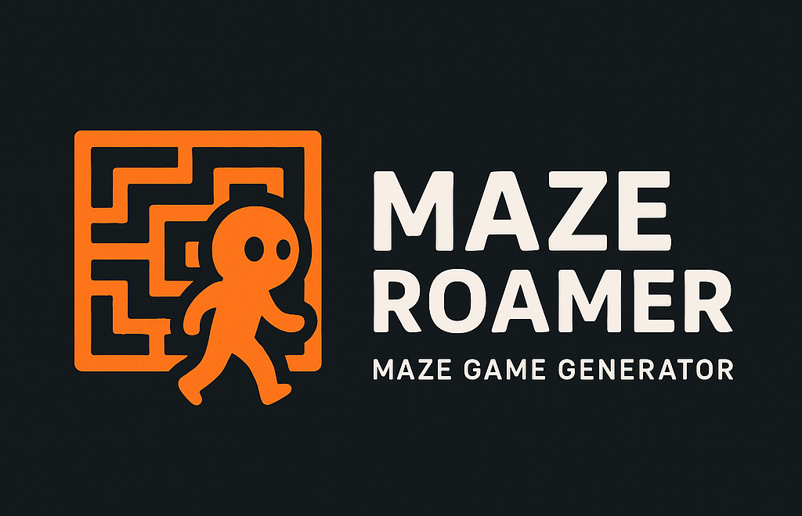

# MazeRoamer - Maze Game Generator



Welcome to **MazeRoamer**, a dynamic maze game generator built with JavaScript and Three.js. Create and explore randomly generated mazes in both 2D top-down and 3D first-person views, featuring smooth character movement, customizable themes (including a Doom-inspired style), and gradient wall aesthetics. Navigate your character through intricate labyrinths, race against the clock, and switch between vibrant and gritty atmospheres—all in your browser!

## Features

- **Random Maze Generation**: Generates unique mazes using a recursive backtracking algorithm.
- **2D/3D View Toggle**: Switch between a top-down 2D view and an immersive 3D first-person perspective.
- **Smooth Movement**: Control a humanoid character with fluid WASD or arrow key movement.
- **Thematic Styles**:
  - *Default Theme*: Vibrant blue-to-purple gradient walls with a gray floor.
  - *Doom Theme*: Dark gray-to-blood-red gradient walls, evoking a gritty, ominous vibe.
- **Timer**: Track your time as you navigate to the maze’s end.
- **Gradient Walls**: Visually appealing wall designs with customizable color gradients.
- **Responsive Design**: Adapts to window resizing for a seamless experience.

## Demo

Try it out live! https://makalin.github.io/MazeRoamer/

## Installation

1. **Clone the Repository**:
   ```bash
   git clone https://github.com/makalin/MazeRoamer.git
   cd MazeRoamer
   ```

2. **Open the Project**:
   - No additional dependencies are required beyond a web browser, as Three.js is loaded via CDN.
   - Simply open `index.html` in a modern browser (e.g., Chrome, Firefox).

   Alternatively, use a local server for better performance:
   ```bash
   npx http-server
   ```
   Then navigate to `http://localhost:8080`.

## Usage

- **Generate a New Maze**: Click the "New Maze" button to create a fresh labyrinth.
- **Switch Views**: Use the "Switch to 2D/3D" button to toggle between perspectives.
- **Change Themes**: Select "Default" or "Doom" from the dropdown to alter the aesthetic.
- **Move the Character**: Use `WASD` or arrow keys to navigate smoothly through the maze.
- **Track Time**: Watch the timer to see how long it takes to reach the end (bottom-right corner).

## Project Structure

- `index.html`: The main file containing HTML, CSS, and JavaScript logic.
- No external assets are required; Three.js is loaded via CDN.

## Customization

- **Maze Size**: Modify `width` and `height` in the JavaScript code to adjust maze dimensions.
- **Themes**: Edit the `themes` object to add new color schemes or tweak existing ones.
  - Example: Change `wallColors` in the Doom theme to `[0x00ff00, 0xff0000]` for a green-to-red gradient.
- **Movement Speed**: Adjust `moveSpeed` for faster or slower character movement.
- **Character Design**: Replace the cylinder-and-sphere model with a custom 3D model by updating the `character` group.

## Future Enhancements

- Add a win condition with an alert when reaching the maze’s end.
- Implement sound effects (e.g., footsteps, ambient music) using a library like Howler.js.
- Introduce lighting effects (e.g., a moving point light) for a more immersive 3D experience.
- Support custom maze sizes via a user interface.

## Contributing

Contributions are welcome! Feel free to:
1. Fork the repository.
2. Create a feature branch (`git checkout -b feature-name`).
3. Commit your changes (`git commit -m "Add feature"`).
4. Push to the branch (`git push origin feature-name`).
5. Open a pull request.

## License

This project is licensed under the MIT License. See [LICENSE](LICENSE) for details.

## Acknowledgments

- Built with [Three.js](https://threejs.org/) for 3D rendering.
- Inspired by classic maze games and the iconic Doom aesthetic.
